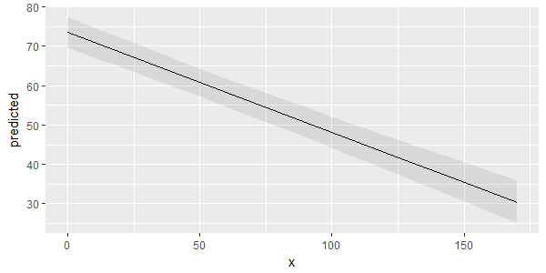

# Summary

Results of regression models, like estimates, are typically presented as tables that are easy to understand. But sometimes the pure estimates are not helpful and difficult to interpret. This is especially true for interaction terms in logistic regression or even more complex models, or transformed terms (quadratic or cubic terms, polynomials, splines), the estimates are no longer interpretable in a direct way. In such cases, _marginal effects_ are far easier to understand. In particular, the visualization of marginal effects makes it possible to intuitively get the idea of how predictors and outcome are associated, even for complex models. 

## Aim of the Package

**ggeffects** is an R-package that aims at easily calculating marginal effects for a broad range of different regression models. This is achieved by three core ideas that describe the philosophy of the function design: 

  1) Functions are type-safe and always return a data frame with the same, consistent structure; 
  2) there is a simple, unique approach to calculate marginal effects for many different models;
  3) the package supports "labelled data" [@daniel_ludecke_2018_1249216], which allows human readable annotations for graphical outputs.
  
This means, users do not need to care about any expensive steps after modelling to visualize the results.

## Consistent Output Structure

The package's functions follow a "tidy data frame" philosophy that return data frames , which are, for instance, ready to use with the **ggplot2**-package [@wickham_ggplot]: `x` and `predicted` are the values for the x- and y-axis. `conf.low` and `conf.high` could be used as `ymin` and `ymax` aesthetics for ribbons to add confidence bands to the plot. `group` can be used as grouping-aesthetics, or for faceting.

The consistent structure of the returned data frames is always the same, no matter for which type of regression model or for which model predictor the marginal effects are calculated. For users, this means less work to adapt code and makes it easy to integrate **ggeffects** into personal workflows or even own R functions.

## Support for many different Models

Marginal effects can be calculated for many different models. Currently supported model-objects are: `lm`, `glm`, `glm.nb`, `lme`, `lmer`, `glmer`, `glmer.nb`, `nlmer`, `glmmTMB`, `gam` (package **mgcv**), `vgam`, `gamm`, `gamm4`, `multinom`, `betareg`, `truncreg`, `coxph`, `gls`, `gee`, `plm`, `lrm`, `polr`, `clm`, `zeroinfl`, `hurdle`, `stanreg`, `brmsfit`, `svyglm` and `svyglm.nb`. Other models not listed here are passed to a generic predict-function and might work as well. Interaction terms, splines and polynomial terms are also supported. 

## Support for Labelled Data

**ggeffects** supports labbeled data, which is especially useful for users who work with datafiles in _Stata_ or _SPSS_ format. Value and variable labels from model predictors are stored as attributes of the returned data frame. There are convenient methods to extract these labels (like `get_x_labels()`) in order to use them as axis or legend labels. However, the `plot()`-method does this automatically (see examples below).

## Examples

The main function is `ggpredict()`. `ggpredict()` requires at least one, but not more than three terms specified in the `terms`-argument. Predicted values of the response, along the values of the first term are calucalted, optionally grouped by the other terms specified in `terms`.

```
library(ggeffects)
library(sjlabelled)
data(efc)
efc$c172code <- as_factor(efc$c172code)
fit <- lm(barthtot ~ c12hour + neg_c_7 + c161sex + c172code, data = efc)

ggpredict(fit, terms = "c12hour")
#> # A tibble: 18 x 5
#>        x predicted conf.low conf.high group
#>    <dbl>     <dbl>    <dbl>     <dbl> <fct>
#>  1     0      75.4     73.3      77.6 1    
#>  2    10      72.9     70.9      74.9 1    
#>  3    20      70.4     68.6      72.2 1    
#>  4    30      67.8     66.1      69.5 1    
#>  5    40      65.3     63.7      67.0 1    
#>  6    50      62.8     61.1      64.4 1    
#>  7    60      60.2     58.5      62.0 1    
#>  8    70      57.7     55.8      59.6 1    
#>  9    80      55.2     53.1      57.3 1    
#> 10    90      52.6     50.3      55.0 1    
#> # ... with 8 more rows
```

*****

A possible call to ggplot could look like this:

```
library(ggplot2)
mydf <- ggpredict(fit, terms = "c12hour")
ggplot(mydf, aes(x, predicted)) +
  geom_line() +
  geom_ribbon(aes(ymin = conf.low, ymax = conf.high), alpha = .1)
```


***** 

However, there is also a `plot()`-method, which takes care of common plot-characteristics and returns a _ggplot_-object.

```
p <- ggpredict(fit, terms = c("c172code", "c161sex"))
plot(p)
```


***** 

## Examples of real-word analysis

**ggeffects** was already used in different publications for creating marginal effect plots [e.g. @bremer_social_2018, @ludecke_for_2018]. Figures were preferred over tables by authors and reviewers, since specifically interaction terms in logistic or negative binomial models are much easier to understand by visualization.

# References
